# New Hire, New Domain
### An Active Directory Home Lab — Onboarding a Sales Employee, End to End

> Built from scratch in VMware Workstation to simulate the exact workflow an IT Support / Helpdesk tech performs when a new employee joins: standing up a domain, provisioning an account, pushing policy, joining a workstation, and resolving a lockout ticket.

---

## Table of Contents
- [Scenario](#scenario)
- [Environment & Tools](#environment--tools)
- [Architecture](#architecture)
- [Build Walkthrough](#build-walkthrough)
  1. [Promote the Domain Controller](#1-promote-the-domain-controller)
  2. [Build the OU Structure](#2-build-the-ou-structure)
  3. [Create the User & Security Group](#3-create-the-user--security-group)
  4. [Configure Password & Lockout Policy](#4-configure-password--lockout-policy)
  5. [Join the Workstation to the Domain](#5-join-the-workstation-to-the-domain)
  6. [Push Resources via Group Policy](#6-push-resources-via-group-policy)
- [The Troubleshooting Moment: A Real GPO Precedence Bug](#the-troubleshooting-moment-a-real-gpo-precedence-bug)
- [The Ticket: Account Lockout → Resolution](#the-ticket-account-lockout--resolution)
- [What This Demonstrates](#what-this-demonstrates)
- [Known Simplifications](#known-simplifications)

---

## Scenario

A new employee, **John Doe**, is joining the **Sales** department. This lab simulates the IT work required to get him productive on day one: an Active Directory account, a security group, a domain-joined workstation, a mapped department drive, and a shared printer — all delivered the way a real company would deliver them, through Group Policy rather than manual configuration on each machine.

Partway through, the lab also produced a **real, unplanned bug** — a Group Policy precedence conflict that silently disabled the account lockout policy — which turned into its own troubleshooting exercise (see below). That bug, and fixing it, is arguably the most representative part of this project, since it's the kind of thing you only encounter by actually building the thing rather than reading about it.

## Environment & Tools

| Component | Details |
|---|---|
| Hypervisor | VMware Workstation Pro 26H1 |
| Domain Controller | `DC01` — Windows Server 2022 Standard (Evaluation), Desktop Experience |
| Client Workstation | `SALES-PC01` — Windows 11 Pro (26H2) |
| Domain | `corp.local` |
| Network | VMware NAT, `192.168.241.0/24` |
| Roles Installed | AD DS, DNS (auto-installed with AD DS) |

## Architecture

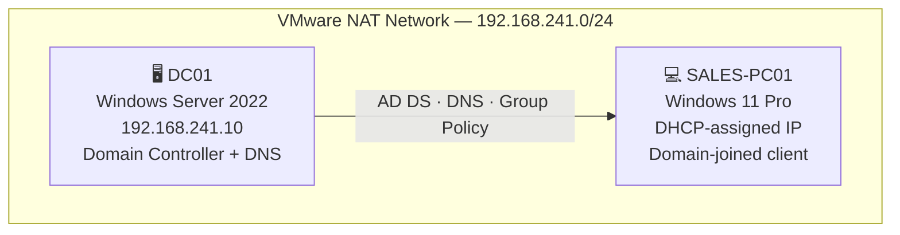

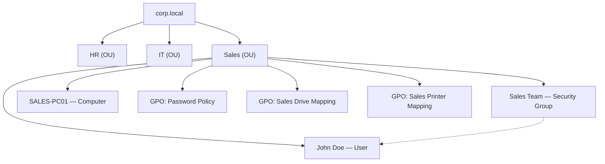

---

## Build Walkthrough

### 1. Promote the Domain Controller
`DC01` was installed with a static IP (`192.168.241.10`) pointing at itself for DNS, then promoted via **Add Roles and Features → Active Directory Domain Services → Promote this server to a domain controller**, creating a new forest: `corp.local`.

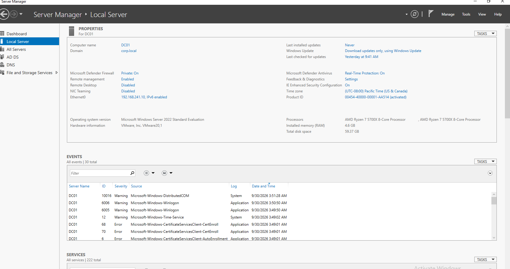

### 2. Build the OU Structure
Three department-based Organizational Units were created under the domain root — `HR`, `IT`, and `Sales` — mirroring how a real company segments users, groups, and computers for delegation and Group Policy targeting.

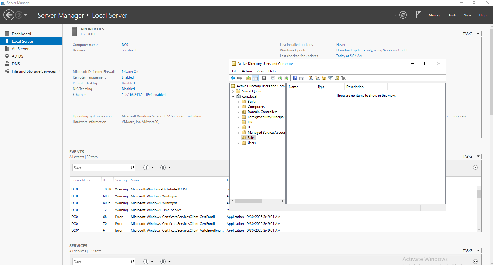

### 3. Create the User & Security Group
Inside the `Sales` OU: a user account (`jdoe` / John Doe) with **"User must change password at next logon"** enabled, and a security group (`Sales Team`) with John Doe added as a member.

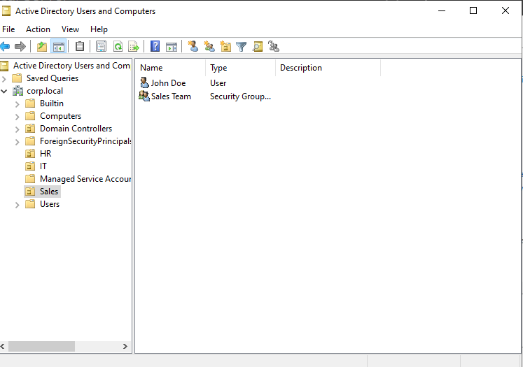
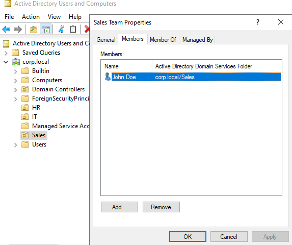

### 4. Configure Password & Lockout Policy
A dedicated GPO (`Password Policy`) was linked at the domain root, defining:

| Setting | Value |
|---|---|
| Enforce password history | 5 passwords remembered |
| Maximum password age | 60 days |
| Minimum password age | 1 day |
| Minimum password length | 8 characters |
| Password complexity | Enabled |
| Account lockout threshold | 5 invalid attempts |
| Account lockout duration | 30 minutes |
| Reset lockout counter after | 30 minutes |

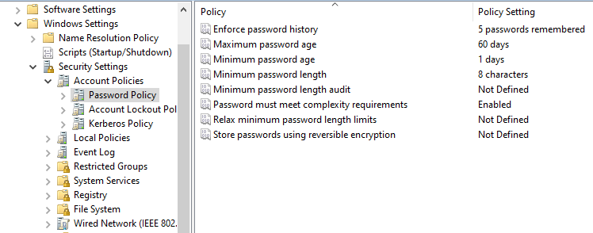
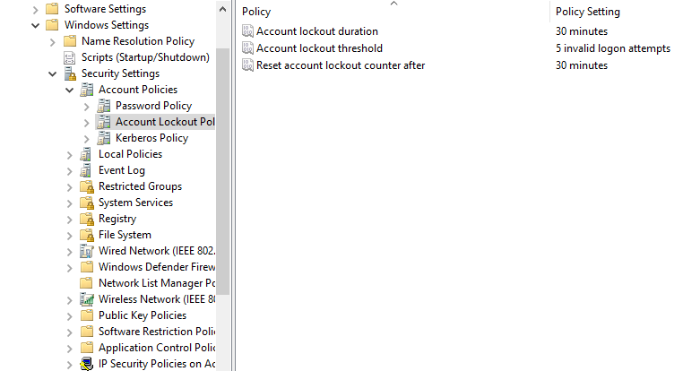

### 5. Join the Workstation to the Domain
`SALES-PC01` (Windows 11 Pro) was pointed at `DC01` for DNS (a required prerequisite — a client can't resolve or join a domain using a generic gateway's DNS), then joined to `corp.local` via **System Properties → Change → Domain**. John Doe was then able to authenticate directly at the Windows login screen as `corp\jdoe`.

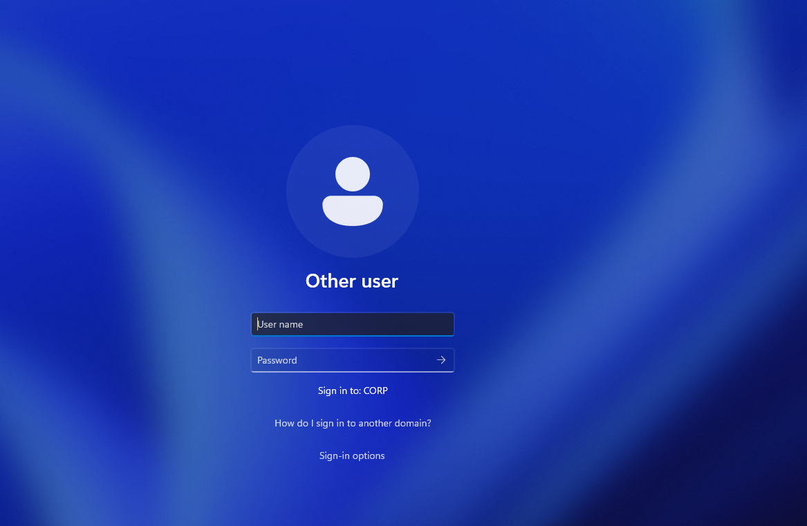

### 6. Push Resources via Group Policy
Two separate GPOs, both linked to the `Sales` OU and scoped under **User Configuration → Preferences**, delivered resources to John Doe's desktop automatically on login — no manual configuration on the client:

- **Mapped Drive** — `S:` → `\\DC01\SalesShare`
- **Shared Printer** — `\\DC01\SalesPrinter` (a driver-only virtual printer, since no physical device was available — Windows still treats it as a real shared print queue for GPO purposes)

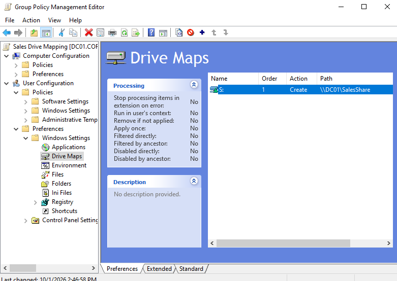
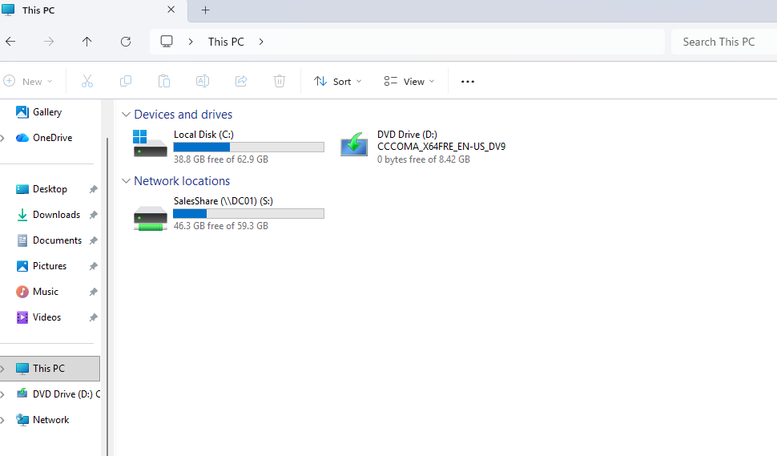
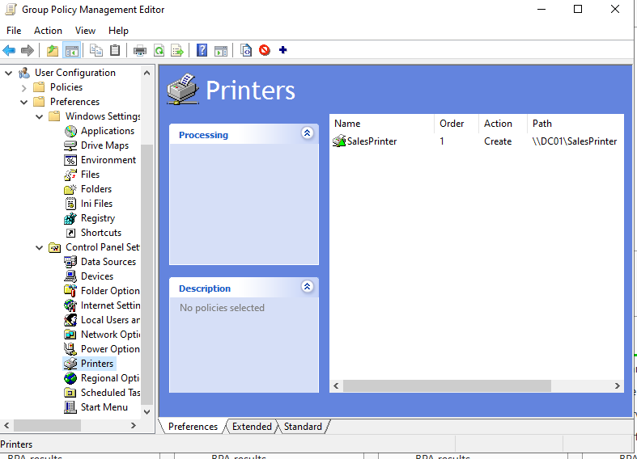
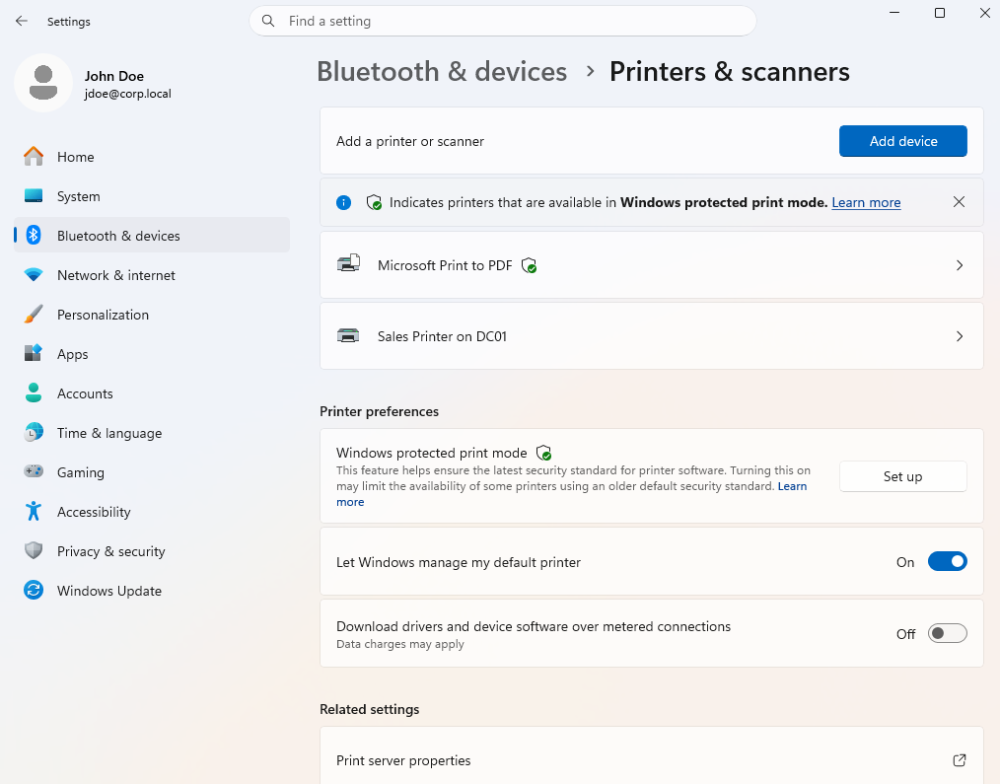

---

## The Troubleshooting Moment: A Real GPO Precedence Bug

After configuring the lockout policy, I deliberately triggered it to simulate a locked-out user calling the helpdesk — by running **15+ failed authentication attempts** against the domain via `runas /user:corp\jdoe cmd`. Each attempt correctly returned:

```
1326: The user name or password is incorrect.
```

...but the account never locked. This was unexpected, since the policy had already been verified as linked and configured.

**Diagnosis:** `gpresult /r` on DC01 confirmed the `Password Policy` GPO *was* applying — but domain Account Lockout/Password policies are enforced based on **GPO link order precedence** at the domain root, not simply "is it linked." The built-in `Default Domain Policy` (which ships with every new AD forest, defaulting the lockout threshold to **0 = disabled**) was linked with *higher* priority than the custom policy, silently overriding it.

```
secpol.msc on DC01 showed:
  Account lockout threshold: 0 invalid logon attempts   ← the bug
```

**Fix:** Reordered the GPO links at the domain root in Group Policy Management, promoting `Password Policy` above `Default Domain Policy` in link order, then forced a refresh (`gpupdate /force`).

| Before | After |
|---|---|
| 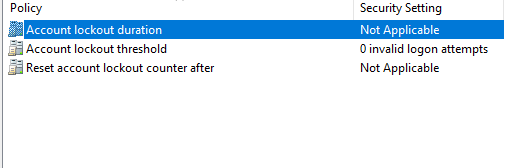 | 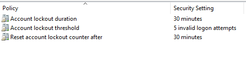 |

Re-running the same failed-login test then correctly returned, on the 5th attempt:

```
1909: The referenced account is currently locked out and may not be logged on to.
```

This is a well-known real-world AD gotcha — domain account policies only take effect as intended when they win the link-order conflict against the defaults — and diagnosing it required reading `gpresult` output, understanding GPO precedence rules, and verifying the fix directly against `secpol.msc` rather than assuming the GPO editor's saved values were automatically "live."

## The Ticket: Account Lockout → Resolution

With the policy now genuinely enforced, the full helpdesk scenario was run end to end:

1. **Lockout triggered** — 5 failed domain authentication attempts against `corp\jdoe`, confirmed via error `1909`.
2. **Verified on DC01** — Active Directory Users and Computers → John Doe → Account tab showed the **"Unlock account — this account is currently locked out on this Active Directory Domain Controller"** flag.
3. **Resolved** — Account unlocked, password reset with **"User must change password at next logon"** re-enabled (mirroring how a real reset is handled).
4. **Confirmed fixed** — John Doe signed in successfully on `SALES-PC01` with the new temporary password and was prompted to set a permanent one on first login.

This mirrors one of the single most common L1 helpdesk tickets in any real organization: *"I'm locked out, can you reset my password?"*

## What This Demonstrates

| Skill Area | Where It Shows Up |
|---|---|
| Active Directory administration | OU design, user/group creation, ADUC navigation |
| Group Policy (GPO) | Drive mapping, printer deployment, password/lockout policy, **and diagnosing a real precedence conflict** |
| DNS & networking fundamentals | Static IP configuration, pointing a client at the correct DNS server, `ipconfig`, `nslookup`, `ping` used throughout for diagnosis |
| Windows client administration | Domain join, Windows 11 Pro setup, TPM/virtualization requirements |
| Ticketing & troubleshooting logic | Reproducing a user-reported issue (lockout), verifying root cause before acting, documenting the fix |
| CLI fluency | `ipconfig /all`, `nslookup`, `gpupdate /force`, `gpresult /r`, `runas`, `net use`, `secpol.msc` |

## Known Simplifications

In the interest of transparency (and because a real interviewer might ask): a few shortcuts were taken that a production environment would handle differently —
- The shared folder permissions were set to `Everyone: Full Control` rather than scoped to the `Sales Team` security group specifically.
- The shared printer has no physical hardware behind it — it exists purely to prove the GPO deployment mechanism.
- Both VMs run as Windows evaluation/unactivated builds, which is standard for a lab but wouldn't fly in production.

---

*Built as a self-directed project to translate CompTIA-style theory (A+ / Network+ / Security+) into hands-on, reproducible IT Support experience.*
