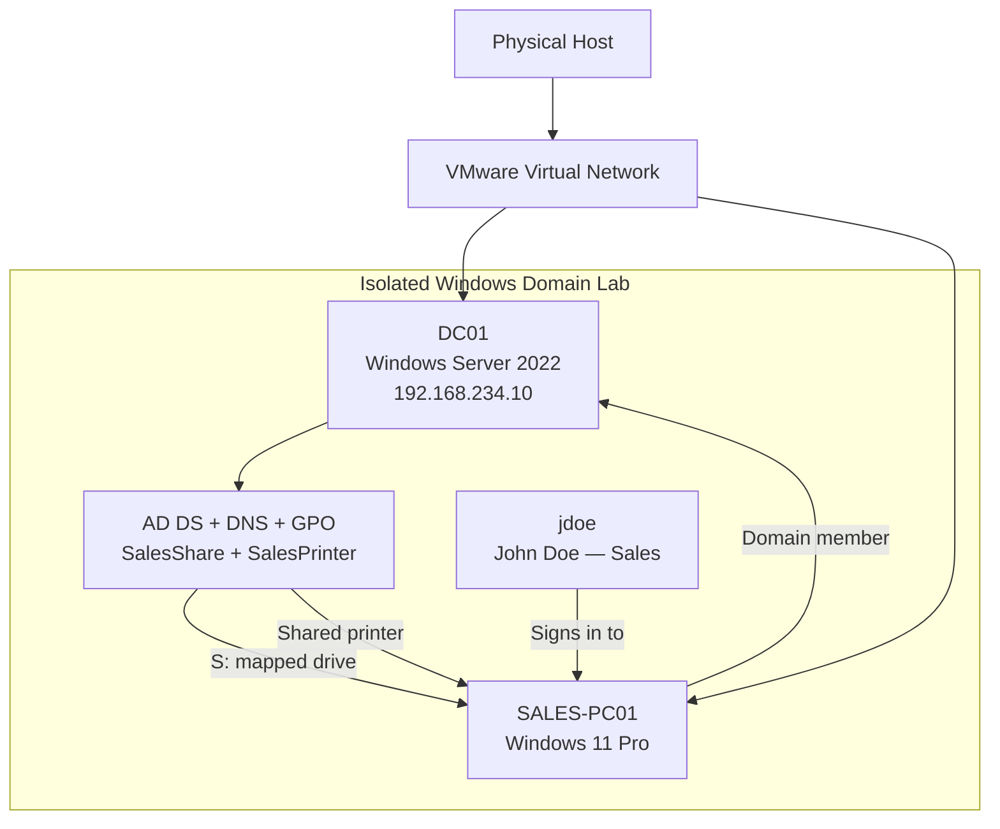

# Enterprise Windows Domain Lab — New Employee Onboarding with Active Directory, DNS & Group Policy

> **Hands-on IT Support / Systems Administration Case Study**  
> A small enterprise-style Windows domain was built in VMware to simulate a real helpdesk request: onboard a new Sales employee, provide access to company resources, enforce account security, and troubleshoot the resulting environment.

---

## Case Study Overview

This lab was designed as a practical simulation of an **IT support / systems administration onboarding ticket** rather than a collection of isolated configuration exercises.

The scenario centers on **John Doe**, a new Sales employee. The objective was to create and organize his domain account, connect his Windows workstation to the company domain, provide department-specific resources, and demonstrate how a support engineer would diagnose and resolve an account-security incident.

The lab was completed inside an isolated VMware environment using a Windows Server 2022 domain controller and a Windows 11 Pro client.

### Scenario

**Situation:** A new Sales employee needs a working corporate Windows account and workstation.

**Task:** Build the underlying Active Directory environment and complete the employee onboarding workflow.

**Actions:**

- Configure a Windows Server 2022 virtual machine as the domain controller.
- Configure static networking and DNS.
- Install **Active Directory Domain Services (AD DS)** and promote the server to a domain controller.
- Create the `corp.local` domain and a basic OU structure.
- Create the Sales user account and security group membership.
- Apply password and account-lockout policies with Group Policy.
- Create a Windows 11 client named `SALES-PC01` and join it to the domain.
- Move the workstation into the Sales OU.
- Publish a department network drive and shared printer through Group Policy.
- Simulate a real helpdesk security ticket by locking the user account, verifying the lockout on the domain controller, and recovering the account.

**Result:** The lab demonstrates an end-to-end employee onboarding workflow covering identity, endpoint configuration, network services, resource access, policy enforcement, and support troubleshooting.

---

## Lab Objectives

The lab was structured around nine practical outcomes:

| Phase | Objective | Status |
|---|---|---|
| 1 | Configure the server and static IP | ✅ Completed |
| 2 | Install AD DS and promote the server to a domain controller | ✅ Completed |
| 3 | Build the Active Directory OU structure | ✅ Completed |
| 4 | Create the employee account and security group | ✅ Completed |
| 5 | Configure password/account-lockout policy | ✅ Completed |
| 6 | Create and domain-join the Windows client | ✅ Completed |
| 7 | Deploy department resources through Group Policy | ✅ Completed |
| 8 | Simulate and resolve the helpdesk account-lockout ticket | ✅ Completed |
| 9 | Capture evidence and document the environment | ✅ Completed |

---

## Technologies & Tools

| Area | Technology / Tool |
|---|---|
| Virtualization | VMware Workstation |
| Server OS | Windows Server 2022 |
| Client OS | Windows 11 Pro |
| Directory Services | Active Directory Domain Services (AD DS) |
| Name Resolution | DNS Server / Windows DNS |
| Policy Management | Group Policy Management / Group Policy Objects (GPOs) |
| Directory Administration | Active Directory Users and Computers (ADUC) |
| Network Diagnostics | `ipconfig`, `ping`, `nslookup` |
| Policy Diagnostics | `gpupdate`, `rsop.msc` |
| File Access | Windows SMB share |
| Printing | Windows shared printer |

---

## Lab Architecture



### Core design

The lab uses a simple single-domain model:

- **Domain:** `corp.local`
- **Domain Controller:** `DC01`
- **Domain Controller IP:** `192.168.234.10`
- **Client:** `SALES-PC01`
- **Employee:** `jdoe` / John Doe
- **Department OU:** `Sales`
- **Security Group:** `Sales Team`
- **Network Share:** `\DC01\SalesShare`
- **Shared Printer:** `\DC01\SalesPrinter`

The gateway used in the VMware network was `192.168.234.2`, while the domain controller itself was configured as the primary DNS server for domain clients.

---

# Implementation Walkthrough

## 1. Build the Windows Server 2022 Domain Controller

The first stage was creating the server virtual machine that would become the foundation of the lab.

The server was configured with approximately:

- **Windows Server 2022**
- **60 GB virtual disk**
- **4 GB RAM**
- **2 virtual processors**
- VMware networking enabled
- Server hostname: **`DC01`**

A clean VM snapshot was also used during the setup process so the environment could be recovered while troubleshooting.


*Figure 1 — VMware virtual-machine creation stage.*

---

## 2. Configure Static Networking and DNS

Before Active Directory was installed, the server needed a stable network identity. The server initially received an address through VMware networking and was then converted to a static configuration.

The lab configuration used:

```text
IP address      : 192.168.234.10
Subnet mask     : 255.255.255.0
Gateway         : 192.168.234.2
Preferred DNS   : 192.168.234.10
```

Connectivity was checked from the command line with:

```bat
ipconfig /all
ping 192.168.234.2
nslookup google.com
ping google.com
```

This stage also reinforced an important troubleshooting distinction: a system can have working local network connectivity while still having a DNS or domain-resolution problem.


*Figure 2 — `ipconfig /all` verification on DC01.*

---

## 3. Install Active Directory Domain Services

The **Active Directory Domain Services** server role was installed through Server Manager.

After the role installation completed, the server was promoted to a domain controller and a new forest/domain was created.

```text
Domain: corp.local
Domain Controller: DC01
```

DNS was installed as part of the domain-controller configuration, allowing the client workstation to discover the domain through the DC's DNS service.


*Figure 3 — AD DS role installation completed successfully.*

---

## 4. Build the Active Directory Structure

A small OU hierarchy was created to represent a realistic departmental structure instead of leaving every object in the default containers.

The lab included:

```text
corp.local
├── Sales
├── HR
└── IT
```

The Sales OU became the location for the employee's user account and workstation-related policy targeting.


*Figure 4 — Active Directory Users and Computers showing the departmental OU structure.*

---

## 5. Create the Employee Account and Security Group

The new employee was created in Active Directory as:

```text
Name      : John Doe
Username  : jdoe
Department: Sales
```

A department security group named **`Sales Team`** was created, and the employee was added to it.

The account and group structure provided a clean foundation for future access control and department-specific policy deployment.

A key support principle demonstrated here is to organize users and resources by business function rather than relying entirely on default Active Directory containers.

---

## 6. Implement Password and Account-Lockout Policies with GPO

A dedicated **Password Policy** GPO was created and linked to the domain.

The lab used an account-security configuration centered around:

- password history enforcement
- maximum password age
- minimum password age
- minimum password length
- account lockout threshold
- lockout duration
- lockout counter reset duration

The account-lockout portion of the lab ultimately used:

```text
Account lockout threshold : 5 invalid logon attempts
Account lockout duration   : 30 minutes
Reset lockout counter     : 30 minutes
```


*Figure 5 — Group Policy configuration used to control password/account security.*

### Why this became a troubleshooting exercise

The first lockout tests did not behave as expected. Investigation showed that the policy was not taking precedence exactly as intended. The troubleshooting process included:

```bat
gpupdate /force
```

and checking the effective policy with:

```text
rsop.msc
```

The GPO link/order was then corrected so that the intended password policy took precedence.

This turned a simple configuration task into a realistic support scenario: **the setting exists, but the effective policy is what matters.**

---

## 7. Build the Windows 11 Sales Workstation

A second VM was created to represent the employee's workstation:

```text
Hostname : SALES-PC01
OS       : Windows 11 Pro
RAM      : 4 GB
CPU      : 2 vCPU
Disk     : 60 GB
Network  : VMware NAT
```

Because Windows 11 requires modern hardware security support, the virtual machine was configured with **vTPM** during setup.

The workstation was initially installed with a local account and then prepared for domain membership.

---

## 8. Join SALES-PC01 to the Domain

Before domain joining, the client was configured to use the domain controller as its DNS server:

```text
Preferred DNS: 192.168.234.10
```

Connectivity was validated with:

```bat
ping 192.168.234.10
ping corp.local
```

The workstation was then joined to:

```text
corp.local
```

using a domain-authorized account.


*Figure 6 — Windows client showing the domain sign-in stage.*

After the join succeeded, the computer object was moved from the default **Computers** container into the **Sales** OU so that department-specific GPOs could target the workstation.


*Figure 7 — `SALES-PC01` positioned under the Sales OU.*

---

# 9. Deploy the Sales Network Drive Through GPO

To simulate a real employee onboarding workflow, a department file share was created on `DC01`.

### Shared resource

```text
\DC01\SalesShare
```

A Group Policy Object named **Sales Drive Mapping** was linked to the Sales OU and configured to map the share automatically for Sales users.

The client was refreshed with:

```bat
gpupdate /force
```

The expected result was a mapped **S:** drive on `SALES-PC01`.


*Figure 8 — Sales network share mapped to the client workstation.*

### Support lesson

When a GPO appears not to work, the first useful checks are:

1. Is the workstation actually in the correct OU?
2. Is the GPO linked to that OU or an inherited parent?
3. Is the client receiving the policy?
4. Does `gpupdate /force` complete successfully?
5. What does `rsop.msc` show as the effective policy?
6. Is the network share itself reachable?

---

# 10. Deploy the Sales Printer Through GPO

A shared printer named **SalesPrinter** was created on `DC01` and published as a network resource.

```text
\DC01\SalesPrinter
```

A second GPO, **Sales Printer Mapping**, was targeted at the Sales OU.

The client was refreshed and the printer was verified from the Windows printer settings.


*Figure 9 — Shared printer available on the Sales workstation.*

The printer step was included because onboarding is not just about creating accounts. In a real environment, a new employee normally needs access to the same shared resources their team already uses.

---

# 11. Simulate a Real Helpdesk Account-Lockout Ticket

The final technical stage converted the lab from a configuration exercise into a support scenario.

### Ticket scenario

> **User:** John Doe — Sales  
> **Issue:** Account cannot authenticate after several failed sign-in attempts.  
> **Support task:** Determine whether the domain account is locked, verify the policy that caused the lockout, and recover the account.

The first lockout attempts did not trigger the expected state. That led to additional troubleshooting rather than assuming the policy was working.

The investigation included checking the account in **Active Directory Users and Computers**, validating the lockout policy on the domain controller, and testing authentication again.

Repeated invalid authentication attempts were generated with domain credentials. The troubleshooting also required clearing existing SMB sessions before retesting credentials:

```bat
net use * /delete
```

A direct credential test was then performed using `runas`, allowing each authentication attempt to reach the domain explicitly:

```bat
runas /user:corp\jdoe cmd
```

After the threshold was reached, the system returned the expected locked-account condition (Windows error **1909**), confirming that the domain account had been locked.


*Figure 10 — Effective account-lockout policy after GPO troubleshooting and precedence correction.*

### Recovery procedure

Once the lockout was confirmed, the support workflow was:

1. Open **Active Directory Users and Computers**.
2. Locate the `jdoe` account under the Sales OU.
3. Open the account properties.
4. Clear the **Unlock account** condition.
5. Reset the password as required.
6. Return to `SALES-PC01` and validate a successful sign-in.

This produced the final support lifecycle:

```text
Onboard user
     ↓
Join workstation
     ↓
Deploy resources
     ↓
Apply security policy
     ↓
Incident occurs
     ↓
Troubleshoot
     ↓
Verify lockout
     ↓
Unlock / reset
     ↓
Retest
```

---

# Troubleshooting Case Study

One of the strongest parts of this lab was that several configuration steps did not work immediately. Instead of treating those as failures, they became the core of the practical troubleshooting exercise.

## Issue 1 — Network / Internet behaviour

The lab distinguished between:

- local network connectivity
- gateway reachability
- DNS resolution
- domain-name resolution
- external connectivity

Useful commands were:

```bat
ipconfig /all
ping 192.168.234.2
ping 192.168.234.10
nslookup google.com
ping google.com
```

This avoided the common mistake of treating every “no internet” symptom as the same problem.

## Issue 2 — Group Policy appeared not to apply

The mapped drive / account-security behaviour was initially inconsistent.

The fix involved:

```bat
gpupdate /force
```

followed by **Resultant Set of Policy** inspection with:

```text
rsop.msc
```

The policy link order and precedence were then corrected so the custom Password Policy could take effect over the default policies.

## Issue 3 — Account lockout testing did not trigger

The first attempts at forcing a lockout were affected by existing authenticated sessions and policy/application state.

The retest process became:

```bat
net use * /delete
runas /user:corp\jdoe cmd
```

with intentionally invalid credentials.

After the policy was confirmed as effective and the authentication attempts were reaching the domain, the account finally entered the locked state and Windows returned the expected error condition.

### Key troubleshooting lesson

**Never stop at “the setting exists.”** A support engineer must verify the effective configuration, the actual authentication path, and the state of the affected resource.

---

# Final Environment State

```text
Windows Server 2022
└── DC01
    ├── Active Directory Domain Services
    ├── DNS
    ├── corp.local
    ├── Sales OU
    │   ├── John Doe (jdoe)
    │   └── SALES-PC01
    ├── HR OU
    ├── IT OU
    ├── Sales Team security group
    ├── SalesShare
    └── SalesPrinter

Windows 11 Pro
└── SALES-PC01
    ├── Domain joined: corp.local
    ├── S: → \DC01\SalesShare
    └── SalesPrinter → \DC01\SalesPrinter
```

---

# What This Lab Demonstrates

This case study demonstrates practical experience with the following areas:

### Active Directory

- Domain controller deployment
- Forest/domain creation
- OU design
- User creation
- Security groups
- Computer objects
- Domain joins
- Account recovery

### Windows Administration

- Windows Server 2022 setup
- Windows 11 workstation deployment
- Hostname and network configuration
- Shared folders and printer administration
- Authentication and account lifecycle operations

### Networking

- IPv4 configuration
- Static addressing
- Gateway testing
- DNS troubleshooting
- Domain name resolution
- Client/server connectivity testing

### Group Policy

- GPO creation
- OU targeting
- Password policy
- Account-lockout policy
- Drive mapping
- Printer deployment
- Policy precedence
- Effective-policy troubleshooting

### IT Support

- Translating a user problem into a technical investigation
- Checking evidence before changing configuration
- Reproducing an issue safely
- Verifying the root cause
- Restoring service
- Documenting the resolution

---

# Evidence Gallery

| Evidence | Screenshot |
|---|---|
| VMware VM creation | `01_vmware_new_vm_wizard.png` |
| DC01 network configuration | `02_dc01_ipconfig.png` |
| AD DS installation | `03_ad_ds_installation.png` |
| AD OU structure | `04_ad_users_and_computers_ous.png` |
| Password policy | `05_group_policy_password_policy.png` |
| Domain sign-in | `06_domain_login.png` |
| Sales OU / workstation placement | `07_sales_ou_structure.png` |
| Mapped Sales drive | `08_mapped_sales_drive.png` |
| Shared printer on client | `09_printer_on_client.png` |
| Account-lockout policy evidence | `10_account_lockout_policy.png` |

---

# Portfolio Value

This lab is useful as a portfolio project because it tells a complete operational story instead of showing only a set of screenshots.

It demonstrates that the environment was not merely configured once: the lab was **tested, broken, investigated, corrected, and validated again**.

That makes the project suitable for demonstrating practical understanding in interviews for roles involving:

- IT Support / Support Engineering
- Systems Administration
- Windows Administration
- Junior System Administration
- Network / Infrastructure Support

---

# Limitations and Next Steps

This is a compact lab, not a production enterprise network. A future version could extend it with:

- a second domain controller for redundancy
- a dedicated DHCP server/scope
- separate client and server network segments
- more granular security groups and NTFS/share permissions
- login scripts and additional GPO hardening
- centralized Windows event collection
- PowerShell automation for onboarding
- backup and restore testing for Active Directory
- a dedicated print server design
- additional test users and departments
- formal ticket documentation and incident timelines

---

# Quick Command Reference

```bat
:: Network information
ipconfig /all

:: Gateway / server reachability
ping 192.168.234.2
ping 192.168.234.10

:: DNS / domain resolution
nslookup google.com
ping corp.local

:: Force Group Policy refresh
gpupdate /force

:: Inspect effective policy
rsop.msc

:: Clear existing SMB connections during credential testing
net use * /delete

:: Explicitly test domain credentials
runas /user:corp\jdoe cmd
```

> **Security note:** The credentials used for this lab should be test-only credentials. Never publish real passwords, tokens, or production domain details in a public repository.

---

# Conclusion

**Enterprise Windows Domain Lab — New Employee Onboarding with Active Directory, DNS & Group Policy** is a practical Windows infrastructure case study that models a complete onboarding and support workflow.

Starting from an empty VMware environment, the lab builds a Windows Server 2022 domain controller, configures DNS and Active Directory, creates departmental structures, provisions a Sales employee, joins a Windows 11 workstation to the domain, deploys a shared drive and printer through Group Policy, and finally simulates and resolves an account-lockout incident.

The most important outcome is the troubleshooting process: when DNS, GPO precedence, or authentication behaviour was not immediately correct, the issue was isolated using concrete tests such as `ipconfig`, `ping`, `nslookup`, `gpupdate`, `rsop.msc`, and explicit domain authentication tests before the final state was verified.

---

## Lab Evidence Source

This README was reconstructed from the complete attached lab conversation capture and its embedded screenshots. The screenshots in this repository are selected evidence crops from that material.
